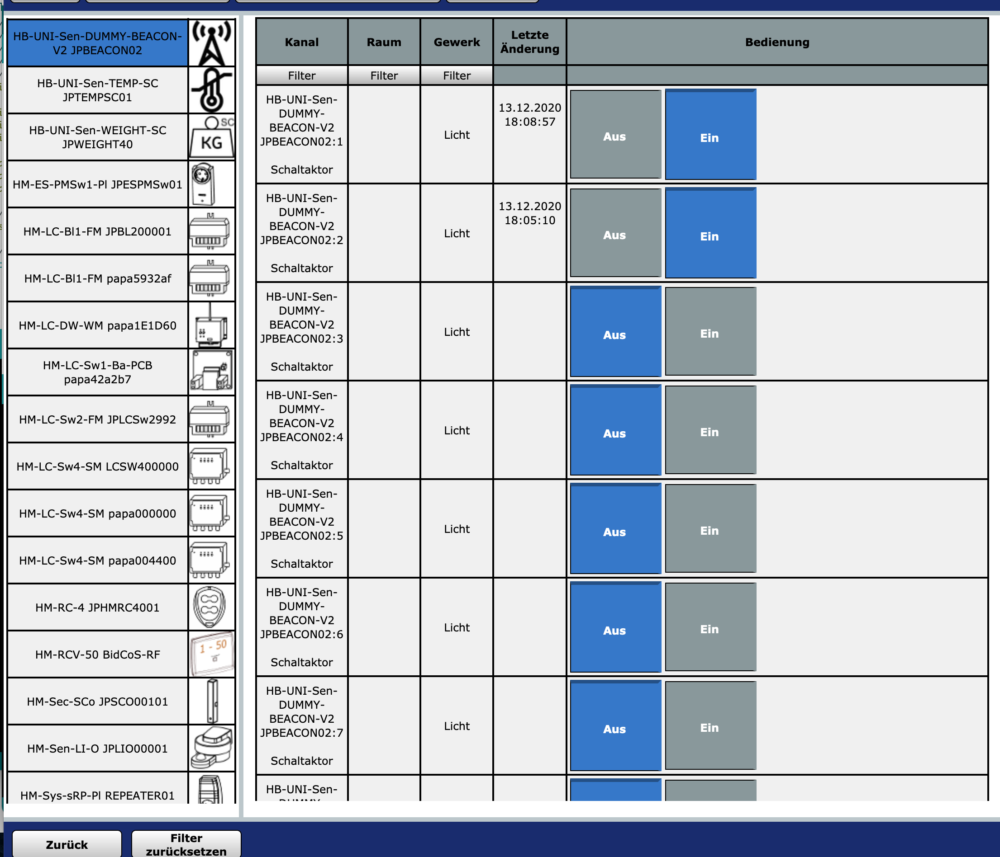
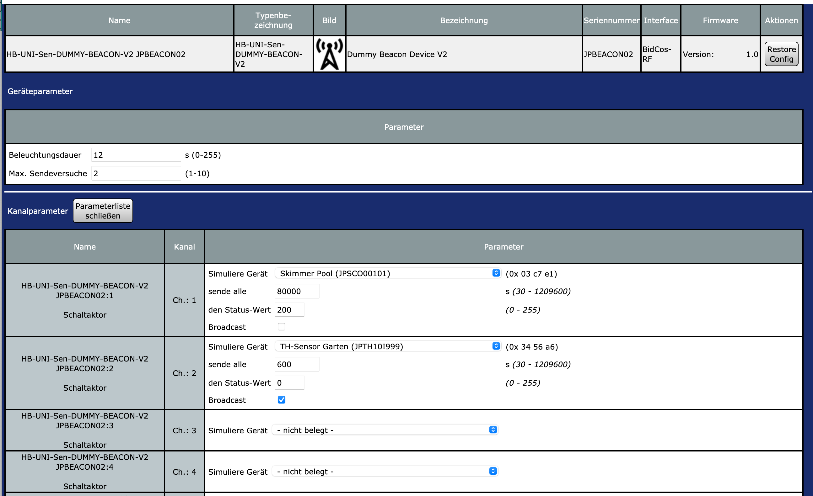
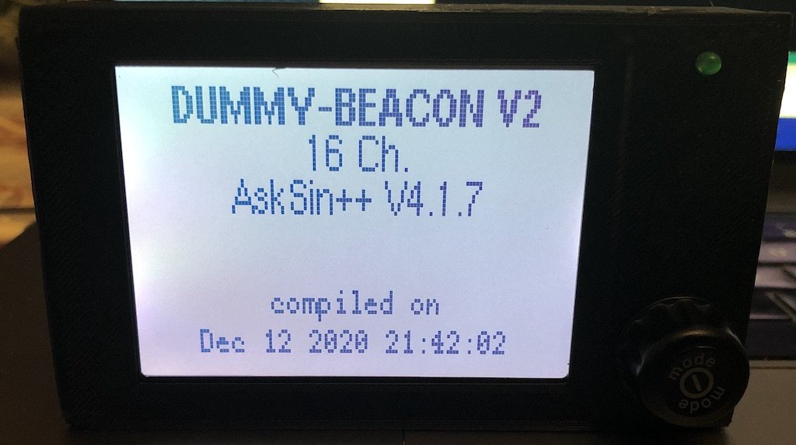
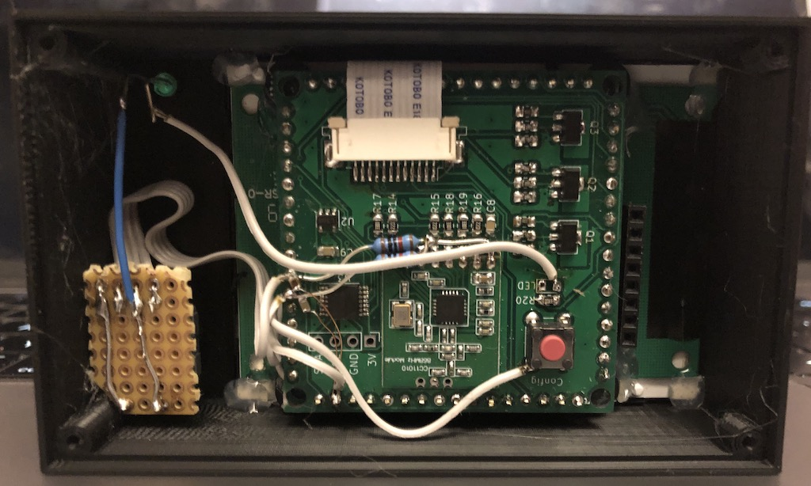
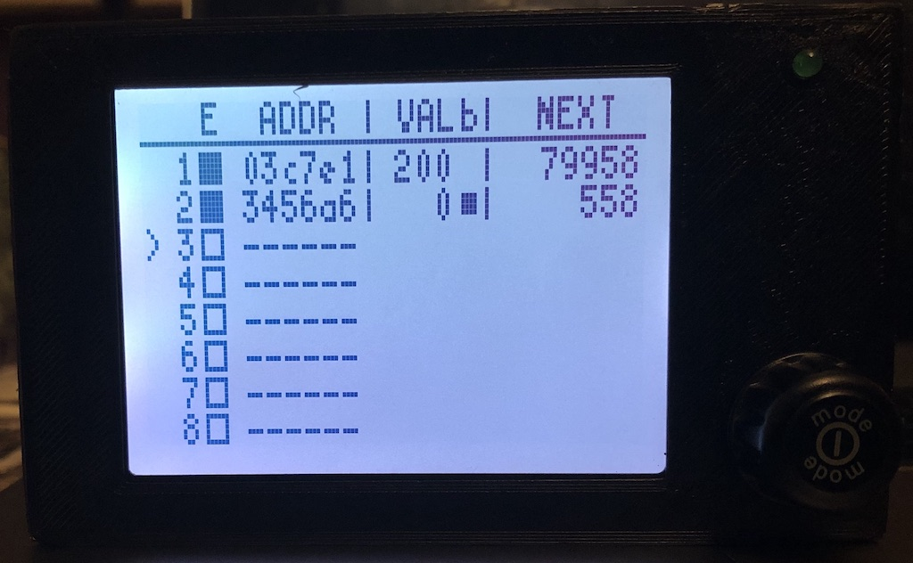

# HB-UNI-Sen-DUMMY-BEACON-V2
**Dummy-Device zum Vermeiden von "Kommunikation gestört"-Servicemeldungen von bis zu 16 inaktiven HomeMatic-Geräten (nur HM-RF, kein HmIP / Wired).** 

Die ist z.B. sehr nützlich bei saisonal verwendeten Geräten, die in Programmen, Diagrammen etc. verwendet, jedoch z.B. in Wintermonaten nicht genutzt werden.
Denn ein Ablernen der Geräte während der Nutzungspausen würde bedeuten, dass Programme nach dem erneuten Anlernen wieder bearbeitet werden müssten.

Es erfolgt:
 - eine automatische Aussendung zyklischer Telegramme an die CCU (bei Sensoren)
   - wahlweise als Broadcast oder bidirektional
 - eine Quittung (Ack) von Steuerbefehlen der CCU (bei Aktoren)
 - eine Übertragung eines Status-Werts, um einen Gerätezustand zu senden (z.B. RHS 0 = Fenster zu, 100 = gekippt, 200 = offen)
 
_Wird ein Telegramm des "echten" Gerätes empfangen, so wird das Aussenden der Fake-Telegramme automatisch deaktiviert, um Kollisionen / Fehlverhalten zu vermeiden._
 
 Jeder der 16 Kanäle lässt sich unter "Status und Bedienung" ein- und ausschalten, um die Übertragung der Dummy-Telegramme für das jeweilige Fake-Device zu (de)aktivieren.
 

## HomeMatic
### Addon installieren
Damit das Gerät von der CCU erkannt und unterstützt wird, ist es erforderlich, das [JP-HB-Devices-addon](https://github.com/jp112sdl/JP-HB-Devices-addon) zu installieren. Es wird **mindestens Version 3.3** benötigt.

### Einstellungen 

### Mein Aufbau 

 

Auf dem Display wird angezeigt,
- welcher Kanal aktiviert ist (E)
- welche Geräteadresse hinterlegt ist (ADDR)
- welcher Status-Wert übertragen wird (VAL)
- ob das Telegramm als Broadcast übertragen wird (b)
- die Restzeit bis zur nächsten Aussendung (NEXT)

Mithilfe eines Dreh-Encoders kann man zu einem Kanal scrollen und diesen durch Drücken (de)aktivieren.

#### CYCLIC_TIMEOUT Werte der HomeMatic-Geräte:

| Device Type | Timeout | Model ID |
|--------|--------|--------|
| HM-CC-RT-DN | 600 | 0x0095 | 
| HM-CC-RT-DN-BoM | 552 | 0x00bd | 
| HM-CC-SCD | 88200 | 0x0056 | 
| HM-CC-TC | 600 | 0x0039 | 
| HM-CC-VD | 3600 | 0x003a | 
| HM-ES-PMSw1-DR | 600 | 0x00ea | 
| HM-ES-PMSw1-Pl | 600 | 0x00ac | 
| HM-ES-PMSw1-Pl-DN-R1 | 600 | 0x00d7 | 
| HM-ES-PMSw1-Pl-DN-R2 | 600 | 0x00e2 | 
| HM-ES-PMSw1-Pl-DN-R3 | 600 | 0x00e3 | 
| HM-ES-PMSw1-Pl-DN-R4 | 600 | 0x00e4 | 
| HM-ES-PMSw1-Pl-DN-R5 | 600 | 0x00e5 | 
| HM-ES-PMSw1-S | 600 | 0x00f6 | 
| HM-ES-TX-WM | 600 | 0x00de | 
| HM-SCI-3-FM | 88200 | 0x005f | 
| HM-Sec-MDIR | 1200 | 0x004a | 
| HM-Sec-MDIR-2 | 1200 | 0x00c0 | 
| HM-Sec-MDIR-3 | 1200 | 0x00f7 | 
| HM-Sec-RHS | 88200 | 0x0030 | 
| HM-Sec-SC | 88200 | 0x002f | 
| HM-Sec-SC-2 | 88200 | 0x00b1 | 
| HM-Sec-SCo | 10000 | 0x00c7 | 
| HM-Sec-SD | 1209600 | 0x0042 | 
| HM-Sec-SD-2 | 259200 | 0x00aa | 
| HM-Sec-TiS | 88200 | 0x0043 | 
| HM-Sec-WDS | 88200 | 0x0045 | 
| HM-Sec-WDS-2 | 88200 | 0x00b2 | 
| HM-Sen-LI-O | 88200 | 0x00fd | 
| HM-Sen-RD-O | 88200 | 0x00a7 | 
| HM-Sen-Wa-Od | 88200 | 0x009f | 
| HM-TC-IT-WM-W-EU | 600 | 0x00ad | 
| HM-WDS10-TH-O | 600 | 0x003d | 
| HM-WDS100-C6-O | 600 | 0x0040 | 
| HM-WDS100-C6-O-2 | 600 | 0x00ae | 
| HM-WDS20-TH-O | 600 | 0x003c | 
| HM-WDS30-OT2-SM | 40000 | 0x00a8 | 
| HM-WDS30-OT2-SM-2 | 40000 | 0x0102 | 
| HM-WDS30-T-O | 600 | 0x000f | 
| HM-WDS40-TH-I | 600 | 0x003f | 
| HM-WDS40-TH-I-2 | 600 | 0x00bc | 

